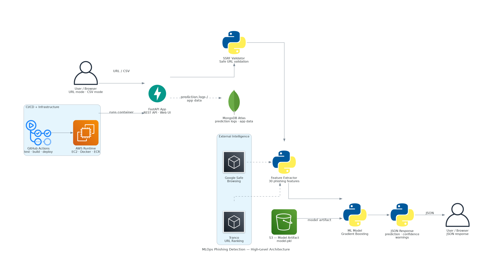
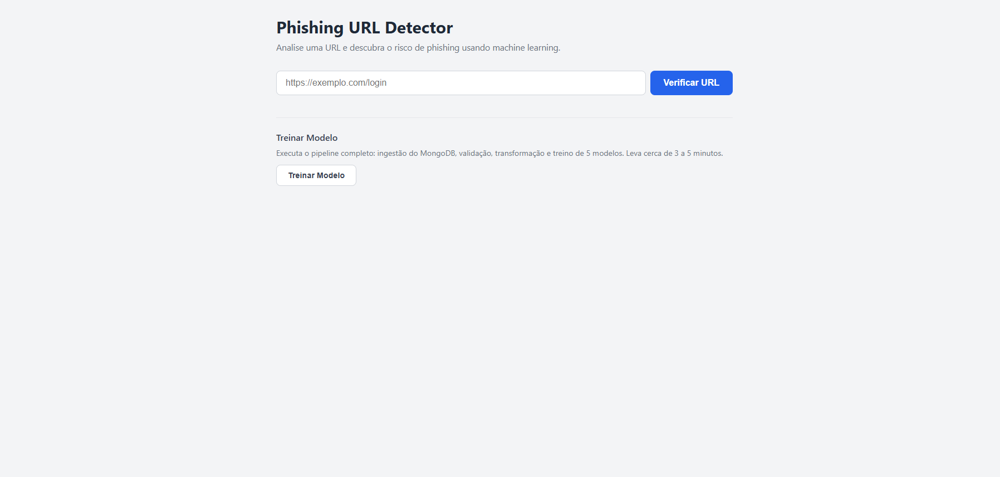
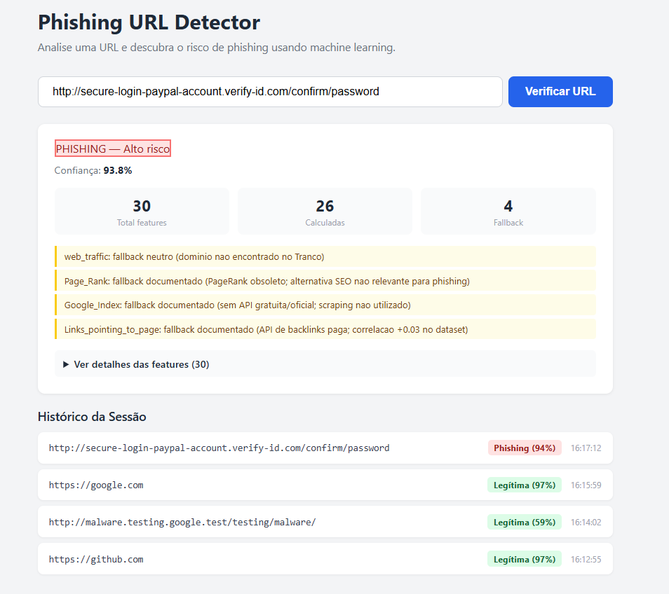
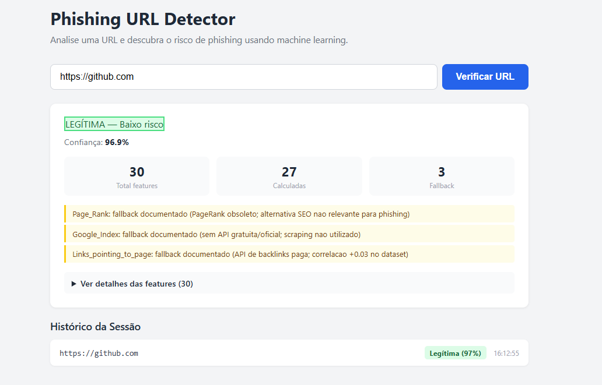
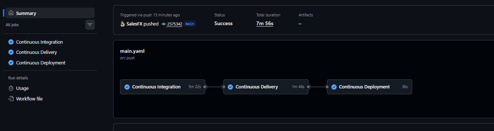

# MLOps Phishing Detection

Plataforma MLOps para deteccao de phishing em URLs. Aceita uma URL bruta ou um CSV com features pre-extraidas, executa o pipeline completo de inferencia e retorna se a URL e phishing ou legitima — com pontuacao de confianca, detalhamento das features e avisos.


---

## Arquitetura



**Stack:** MongoDB Atlas · scikit-learn · MLflow · FastAPI · Docker · AWS S3 / ECR / EC2 · GitHub Actions · Terraform

---

## Interface

| Tela inicial | Resultado phishing + Historico |
|--------------|-------------------------------|
|  |  |

| Resultado legitima | Pipeline CI/CD |
|--------------------|----------------|
|  |  |

---

## Modos de predicao

### Predicao por URL — `POST /predict-url`

O usuario envia uma URL bruta. O sistema automaticamente:

1. Valida a URL contra regras de protecao SSRF
2. Extrai 30 features numericas em 4 grupos (string, HTTP/HTML, DNS/WHOIS, APIs externas)
3. Monta o vetor ordenado de 30 posicoes
4. Executa o modelo Gradient Boosting treinado
5. Retorna predicao, confianca, todas as features e avisos

```bash
curl -X POST http://localhost:8080/predict-url \
  -H "Content-Type: application/json" \
  -d '{"url": "https://exemplo.com/login"}'
```

```json
{
  "url": "https://exemplo.com/login",
  "prediction": "legitimate",
  "confidence": 0.97,
  "features": { "having_IP_Address": 1, "SSLfinal_State": 1 },
  "feature_vector": [1, 1, 1, 1, 1, 1, 0, 1, 0, 0, 1, 1, 0, 0, 0, 1, 1, 1, 1, 1, 1, 1, 1, 1, 1, 1, 0, 0, 0, 0],
  "extraction_status": { "total_features": 30, "calculated_features": 27, "fallback_features": 3 },
  "warnings": ["Page_Rank: fallback documentado ..."]
}
```

### Predicao por CSV — `POST /predict`

Aceita um arquivo CSV com as 30 features pre-extraidas. Retorna uma tabela HTML com a coluna `predicted_column` adicionada. Indicado para processamento em lote, reprocessamento de datasets e experimentos tecnicos.

```bash
curl -X POST http://localhost:8080/predict \
  -F "file=@data/samples/predict_sample.csv"
```

> Contratos completos: [docs/api.md](docs/api.md)

---

## Rodando localmente

```bash
# 1. Clone e instale
git clone https://github.com/SalesFX/MLOps-PhishingDetection.git
cd MLOps-PhishingDetection
pip install -e ".[dev]"

# 2. Configure o ambiente
echo "MONGO_DB_URL=sua_connection_string" > .env

# 3. Suba a aplicacao
python app.py

# 4. Acesse
# http://localhost:8080/url-checker
```

> O modelo precisa ser treinado antes das predicoes. Use o botao **Treinar Modelo** na interface ou acesse `GET /train`.

---

## Rotas

| Rota | Metodo | Descricao |
|------|--------|-----------|
| `/url-checker` | GET | Interface web |
| `/predict-url` | POST | Predicao por URL bruta |
| `/predict` | POST | Predicao por CSV de features |
| `/train` | GET | Executa o pipeline de treinamento |
| `/docs` | GET | OpenAPI / Swagger UI |

---

## Variaveis de ambiente

| Variavel | Obrigatoria | Descricao |
|----------|-------------|-----------|
| `MONGO_DB_URL` | Sim | String de conexao com o MongoDB Atlas |
| `GOOGLE_SAFE_BROWSING_API_KEY` | Nao | Habilita a feature `Statistical_report` via Google Safe Browsing |

Sem `GOOGLE_SAFE_BROWSING_API_KEY` o sistema funciona normalmente — `Statistical_report` usa fallback `0` com aviso na resposta.

---

## Testes

```bash
uv run pytest tests/ -v
```

151 testes — todas as dependencias externas sao mockadas, sem necessidade de conexao real.

---

## Documentacao

| Documento | Conteudo |
|-----------|----------|
| [docs/api.md](docs/api.md) | Contratos completos e schemas de request/response |
| [docs/feature-extraction.md](docs/feature-extraction.md) | As 30 features, grupos, semantica e estrategia de fallback |
| [docs/security.md](docs/security.md) | Protecao SSRF: regras e implementacao |
| [docs/infra-spec.md](docs/infra-spec.md) | Especificacao da infraestrutura Terraform |

---

## Limitacoes conhecidas

- **Ranking Tranco** mede popularidade, nao seguranca — usado como sinal auxiliar fraco para `web_traffic`
- **Google Safe Browsing** requer chave de API; sem ela, `Statistical_report` usa fallback `0`
- **PageRank** original foi descontinuado em 2016; Open PageRank mede autoridade de SEO, nao risco de phishing
- **Google Index** nao possui API gratuita oficial; scraping do Google nao e utilizado
- **Backlinks** (`Links_pointing_to_page`) exigem APIs pagas; correlacao com phishing e de apenas +0.03 no dataset
- O resultado do modelo e probabilistico — serve como apoio a analise, nao como veredicto absoluto
