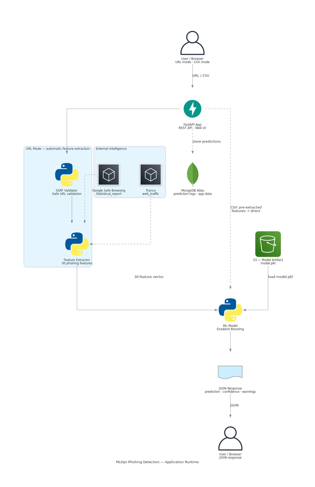
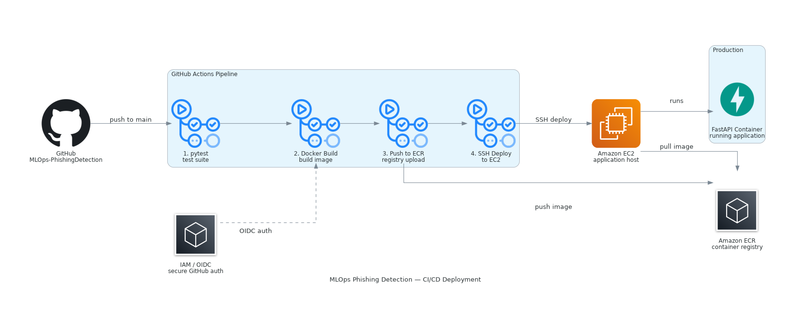
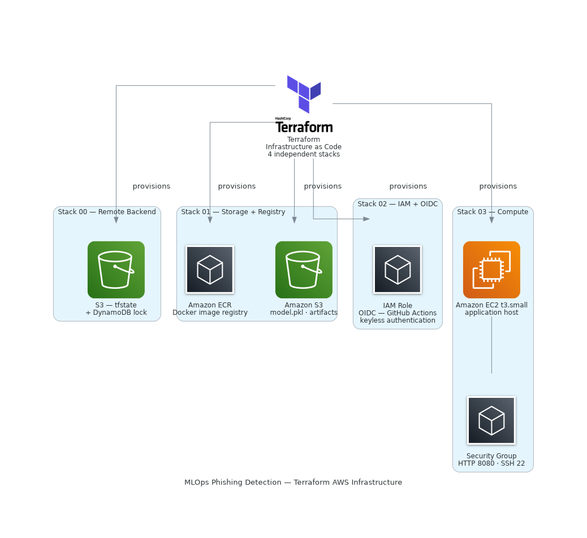

# MLOps Phishing Detection

Plataforma MLOps de produção para detecção de phishing em URLs. O sistema recebe uma URL bruta, extrai automaticamente 30 features numéricas (estrutura da URL, conteúdo HTTP/HTML, DNS, WHOIS e APIs externas), alimenta um modelo de machine learning treinado no dataset UCI Phishing Websites e retorna se a URL é phishing ou legítima, com pontuação de confiança, detalhamento completo das features e avisos sobre fallbacks utilizados.

Também aceita CSV com features pré-extraídas para uso técnico, batch e experimentos.


---

## Stack

| Tecnologia | Função | Por que foi escolhida |
|------------|--------|-----------------------|
| **Python 3.12** | Linguagem principal | Ecossistema ML maduro, tipagem estática moderna com type hints |
| **FastAPI** | API REST e interface web | Alto desempenho, OpenAPI automático, suporte nativo a async |
| **scikit-learn** | Modelo de ML | Pipeline completo: pré-processamento + GridSearchCV + 5 classificadores |
| **MLflow** | Rastreamento de experimentos | Registro de métricas, parâmetros e artefatos por execução de treino |
| **MongoDB Atlas** | Armazenamento de dados | Dataset de phishing (11 mil registros) com ingestão direta via pymongo |
| **httpx** | Requisições HTTP assíncronas | Suporte a async/await, timeout configurável, mock nativo com respx |
| **BeautifulSoup4** | Parse de HTML | Extração de features de conteúdo da página (iframes, forms, anchors, etc.) |
| **python-whois** | Consultas WHOIS | Idade do domínio e tempo de registro para detecção de domínios recém-criados |
| **Google Safe Browsing** | Inteligência de ameaças | Verificação opcional da URL em base de dados de phishing/malware do Google |
| **Tranco** | Ranking de popularidade | Sinal auxiliar de tráfego de domínio como substituto gratuito ao Alexa |
| **Docker** | Containerização | Build reproduzível, deploy consistente entre ambientes |
| **AWS ECR** | Registro de imagens | Armazenamento das imagens Docker para deploy na EC2 |
| **AWS EC2** | Servidor de produção | Hospeda o container Docker com a API FastAPI |
| **AWS S3** | Artefatos do modelo | Armazenamento dos arquivos `.pkl` do modelo e preprocessador treinados |
| **GitHub Actions** | CI/CD | Pipeline automatizado: testes, build Docker, push ECR e deploy via SSH |
| **Terraform** | Infraestrutura como código | Provisionamento de ECR, S3, EC2, IAM e OIDC em 4 stacks independentes |
| **OIDC (GitHub Actions)** | Autenticação AWS | Elimina chaves de acesso estáticas; o runner assume role via token federado |
| **pytest** | Testes automatizados | 151 testes com mocks para HTTP, DNS, WHOIS e APIs externas |

---

## Arquitetura

### Application Runtime

Como a aplicação recebe uma URL ou CSV, extrai features, chama o modelo e retorna a predição.



### CI/CD Deployment

Como o código sai do GitHub, é testado, empacotado em Docker e implantado na AWS.



### Infraestrutura AWS — Terraform

Quais recursos AWS são provisionados como código.



---

## Interface

| Tela inicial | Resultado phishing + Histórico |
|--------------|-------------------------------|
|  |  |

| Resultado legitima | Pipeline CI/CD |
|--------------------|----------------|
|  |  |

---

## Modos de predição

### Predição por URL — `POST /predict-url`

O usuário envia uma URL bruta. O sistema automaticamente:

1. Valida a URL contra regras de proteção SSRF
2. Extrai 30 features numéricas em 4 grupos (string, HTTP/HTML, DNS/WHOIS, APIs externas)
3. Monta o vetor ordenado de 30 posições
4. Executa o modelo Gradient Boosting treinado
5. Retorna predição, confiança, todas as features e avisos

```bash
curl -X POST http://localhost:8080/predict-url \
  -H "Content-Type: application/json" \
  -d '{"url": "https://exemplo.com/login"}'
```

```json
{
  "url": "https://exemplo.com/login",
  "prediction": "legitimate",
  "confidence": 0.97,
  "features": { "having_IP_Address": 1, "SSLfinal_State": 1 },
  "feature_vector": [1, 1, 1, 1, 1, 1, 0, 1, 0, 0, 1, 1, 0, 0, 0, 1, 1, 1, 1, 1, 1, 1, 1, 1, 1, 1, 0, 0, 0, 0],
  "extraction_status": { "total_features": 30, "calculated_features": 27, "fallback_features": 3 },
  "warnings": ["Page_Rank: fallback documentado ..."]
}
```

### Predição por CSV — `POST /predict`

Aceita um arquivo CSV com as 30 features pré-extraídas. Retorna uma tabela HTML com a coluna `predicted_column` adicionada. Indicado para processamento em lote, reprocessamento de datasets e experimentos técnicos.

```bash
curl -X POST http://localhost:8080/predict \
  -F "file=@data/samples/predict_sample.csv"
```

> Contratos completos: [docs/api.md](docs/api.md)

---

## Rodando localmente

```bash
# 1. Clone e instale
git clone https://github.com/SalesFX/MLOps-PhishingDetection.git
cd MLOps-PhishingDetection
pip install -e ".[dev]"

# 2. Configure o ambiente
echo "MONGO_DB_URL=sua_connection_string" > .env

# 3. Suba a aplicação
python app.py

# 4. Acesse
# http://localhost:8080/url-checker
```

> O modelo precisa ser treinado antes das predições. Use o botão **Treinar Modelo** na interface ou acesse `GET /train`.

---

## Rotas

| Rota | Método | Descrição |
|------|--------|-----------|
| `/url-checker` | GET | Interface web |
| `/predict-url` | POST | Predição por URL bruta |
| `/predict` | POST | Predição por CSV de features |
| `/train` | GET | Executa o pipeline de treinamento |
| `/docs` | GET | OpenAPI / Swagger UI |

---

## Variáveis de ambiente

| Variável | Obrigatória | Descrição |
|----------|-------------|-----------|
| `MONGO_DB_URL` | Sim | String de conexão com o MongoDB Atlas |
| `GOOGLE_SAFE_BROWSING_API_KEY` | Não | Habilita a feature `Statistical_report` via Google Safe Browsing |

Sem `GOOGLE_SAFE_BROWSING_API_KEY` o sistema funciona normalmente. `Statistical_report` usa fallback `0` com aviso na resposta.

---

## Testes

```bash
uv run pytest tests/ -v
```

151 testes. Todas as dependências externas são mockadas, sem necessidade de conexão real.

---

## Documentação

| Documento | Conteúdo |
|-----------|----------|
| [docs/api.md](docs/api.md) | Contratos completos e schemas de request/response |
| [docs/feature-extraction.md](docs/feature-extraction.md) | As 30 features, grupos, semântica e estratégia de fallback |
| [docs/security.md](docs/security.md) | Proteção SSRF: regras e implementação |
| [docs/infra-spec.md](docs/infra-spec.md) | Especificação da infraestrutura Terraform |

---

## Limitações conhecidas

- **Ranking Tranco** mede popularidade, não segurança. Usado como sinal auxiliar fraco para `web_traffic`
- **Google Safe Browsing** requer chave de API. Sem ela, `Statistical_report` usa fallback `0`
- **PageRank** original foi descontinuado em 2016. Open PageRank mede autoridade de SEO, não risco de phishing
- **Google Index** não possui API gratuita oficial. Scraping do Google não é utilizado
- **Backlinks** (`Links_pointing_to_page`) exigem APIs pagas. Correlação com phishing é de apenas +0.03 no dataset
- O resultado do modelo é probabilístico. Serve como apoio à análise, não como veredicto absoluto
